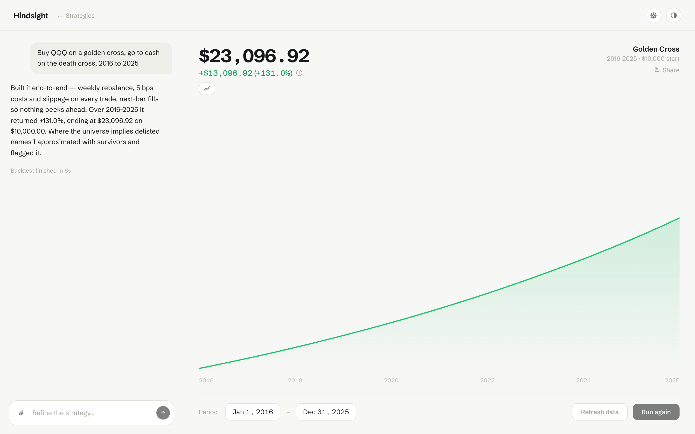
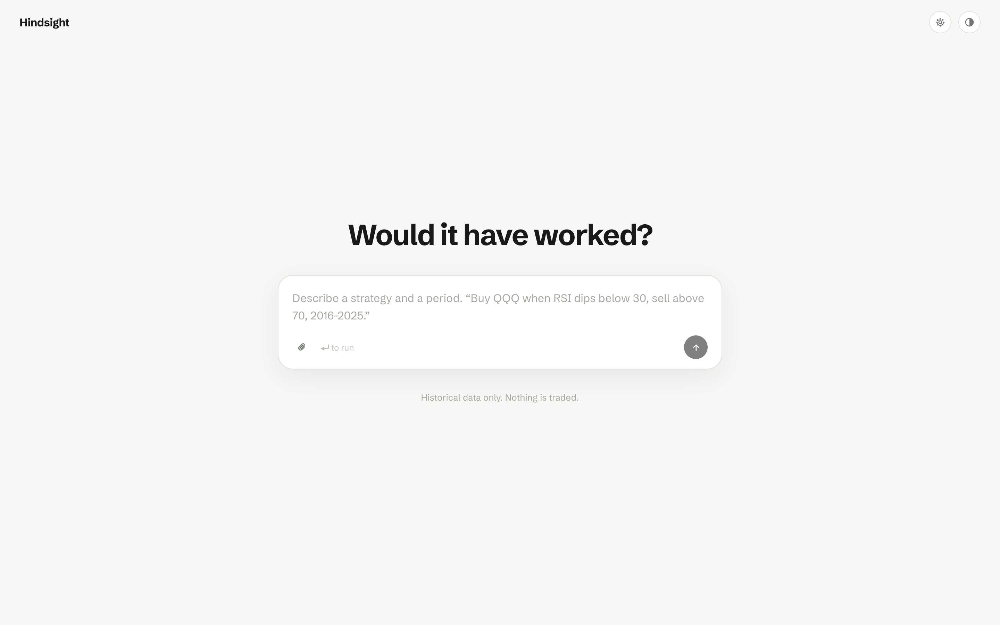
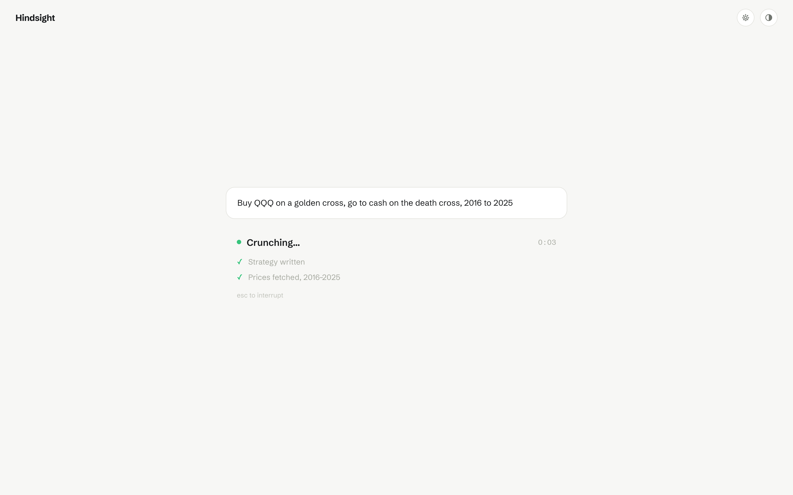
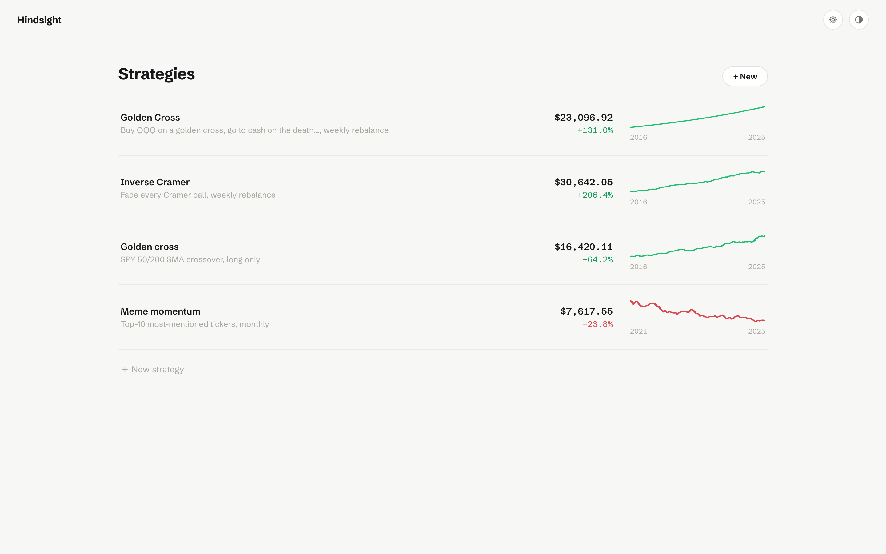
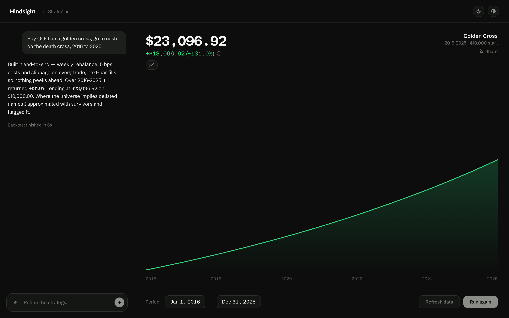

# Hindsight

**[hindsight.build](https://hindsight.build)** · A local, single-user **AI
investment-strategy backtester**. Describe a strategy and a period in plain English;
an agent writes and runs a real backtest on historical data, streams its progress,
and returns an equity curve you can refine by chatting.

> Historical data only. Nothing is traded.

<p align="center">
  
</p>

<table>
  <tr>
    <td></td>
    <td></td>
  </tr>
  <tr>
    <td></td>
    <td></td>
  </tr>
</table>

## Quick start

Requires **[Bun](https://bun.sh) 1.x** and **Node ≥ 20.9** (Next.js runs on Node).

```bash
bun install
bun run seed       # optional: load the three example strategies
bun run dev        # http://localhost:3000   (or: bun run build && bun run start)
```

By default Hindsight runs the **mock agent** — an in-process, procedural backtester that
needs no Docker or API keys. The whole app is fully usable and demoable this way. To run
**real** backtests, enable the Codex + Docker agent (below).

## Two agent backends

Selected by `HINDSIGHT_AGENT` (see `.env.example`):

| Mode | What it does | Requirements |
|------|--------------|--------------|
| `mock` (default) | Streams a believable run and returns a deterministic, seeded equity curve. Great for UI/demo/offline. | none |
| `codex` | Spawns a **Docker container per run** that runs `codex exec`; the agent writes real Python, fetches/scrapes whatever data the strategy needs, and runs a realistic backtest. | Docker daemon running, Codex CLI auth in `~/.codex` |

### Enabling the real (Codex) backend

```bash
bun run docker:build                   # builds ./docker → hindsight-agent:latest
# ensure the Docker daemon is running and you're logged into Codex CLI (~/.codex)
HINDSIGHT_AGENT=codex bun run dev      # or: bun run build && HINDSIGHT_AGENT=codex bun run start
```

If Codex isn't signed in on the host, the app says so instead of failing mid-run: the
empty-state composer is disabled with "Codex is not signed in on this machine." plus the
`codex login` hint, and `POST /api/sessions` / `POST …/messages` return **503**. Readiness
comes from `GET /api/health` (re-checked when the tab regains focus, so logging in from a
terminal unblocks the composer without a reload).

Each run mounts a per-session working directory into the container and runs the agent
with `codex exec --dangerously-bypass-approvals-and-sandbox` (safe because the container
*is* the sandbox — network on, isolated FS, torn down after the run). The agent follows
[`docker/AGENTS.md`](docker/AGENTS.md), which encodes the realism rules and the file
protocol it must obey.

## How it works

```
Browser (React)  ──HTTP──▶  Next.js API routes  ──▶  Run manager (singleton)
     ▲                                                      │
     └────────────── SSE (/stream) ◀── progress frames ─────┤
                                                            ▼
                                              AgentRunner  (mock | codex-in-Docker)
                                                            │  events.ndjson + result.json
                                                            ▼
                                              Session store (JSON files on disk)
```

- **One session per strategy.** Sessions persist as JSON under `./data/` and appear in the
  list. *Results persist; a run in flight when the server restarts is marked failed* (no
  reattach — a deliberate v1 choice).
- **Streaming.** The run manager parses the agent's structured progress into Server-Sent
  Events; the UI renders the live "Working" view (steps, elapsed, whimsical status words),
  then transitions to the chart + chat "Expanded" view.
- **Re-runs reuse code.** Changing the dates ("Run again") re-executes the saved strategy
  over the new range with no LLM call. "Refresh data" clears the per-session data snapshot
  and re-fetches. Chatting refines the strategy (the agent edits the existing code).
- **Images.** Attach, paste, or drop up to 4 images (PNG/JPEG/WebP/GIF, 10 MB each) on a
  new strategy or a refinement — a chart to match, a table of weights, a screenshot. They're
  handed to Codex with `codex exec -i`, so the agent genuinely sees them. In chat an image
  with no text is a valid message; a new strategy still needs a prompt. (The mock agent
  stores and shows them but can't read them.)
- **Compare.** The small toggle under the return overlays a dashed buy-and-hold curve for
  the strategy's own underlying (QQQ for a QQQ strategy, else the broad market) on the same
  axes. It's a plain price fetch — instant, no agent run.
- **Enforced realism.** Every real backtest uses adjusted (total-return) prices, applies
  transaction costs + slippage, models short borrow, and avoids lookahead / survivorship
  bias. See [`PROTOCOL.md`](PROTOCOL.md) §5 and [`docker/AGENTS.md`](docker/AGENTS.md).
- **Sharing.** The Share button mints a secret link and exposes it through a
  [`cloudflared`](https://developers.cloudflare.com/cloudflare-one/connections/connect-networks/downloads/)
  quick tunnel (install it separately; the dialog tells you if it's missing). Tunnel
  visitors can reach exactly one thing — a static, read-only, no-JavaScript HTML page for
  the shared strategy. `proxy.ts` 404s everything else (the app, the API, all assets) for
  any request that arrives through a tunnel. Revoking the share kills the link instantly.

## Configuration

Copy `.env.example` → `.env` and adjust:

| Var | Default | Meaning |
|-----|---------|---------|
| `HINDSIGHT_AGENT` | `mock` | `mock` or `codex` |
| `HINDSIGHT_DOCKER_IMAGE` | `hindsight-agent:latest` | image for real runs |
| `HINDSIGHT_CODEX_HOME` | `~/.codex` | Codex auth mounted (read-only) into the container |
| `HINDSIGHT_CODEX_MODEL` | `gpt-5.6-sol` | model passed to `codex exec -m` |
| `HINDSIGHT_DATA_DIR` | `./data` | session store + per-session workdirs |

## Project layout

```
app/                 Next.js App Router — pages + API routes + SSE
components/           React UI
lib/                  Shared contract: types, format, chart math, tokens, theme, period
lib/agent-runner.ts   The AgentRunner interface both backends implement
lib/client/           Client data layer: fetch helpers + SSE / session / theme hooks
lib/server/           Session store, run manager, and the agent layer
  agent/               mock runner, codex-in-Docker runner, prompt builder, mock curve
docker/               Image + AGENTS.md + entrypoint for real Codex runs
proxy.ts              Tunnel gate: share links expose ONE read-only page, nothing else
scripts/seed.mjs      Seeds the three example strategies
PROTOCOL.md           The binding API / SSE / agent-file contract
```

## Scripts

| Command | Description |
|---------|-------------|
| `bun run dev` | Dev server |
| `bun run build` / `bun run start` | Production build + serve |
| `bun run typecheck` | `tsc --noEmit` |
| `bun run seed` | Load the three example strategies |
| `bun run docker:build` | Build the agent container image |

## Notes & limits (v1)

- Single-user, local, no auth — **don't expose it to the internet** (see
  [SECURITY.md](SECURITY.md)). State lives on your machine under `./data/`.
- Runs have no hard time cap — press `esc` to interrupt (kills the container in Codex mode).
- The mock's equity curves are procedurally generated placeholders; real Codex output
  replaces them with genuine backtests.
- Backtests are simulations over historical data. Nothing here is investment advice.

## Contributing & license

Contributions welcome — see [CONTRIBUTING.md](CONTRIBUTING.md). Security reports:
[SECURITY.md](SECURITY.md). Released under the [MIT License](LICENSE).
